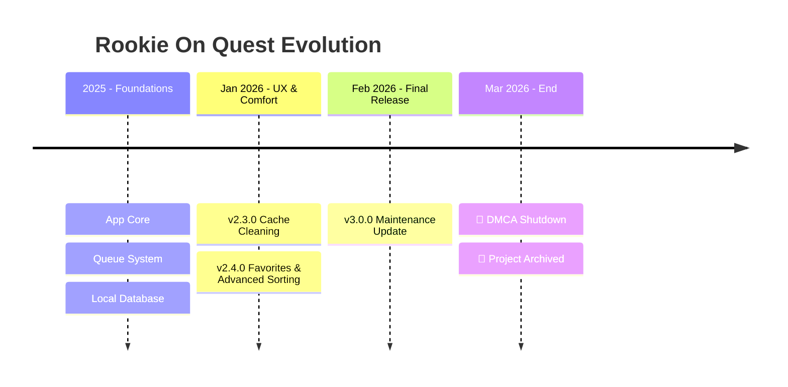
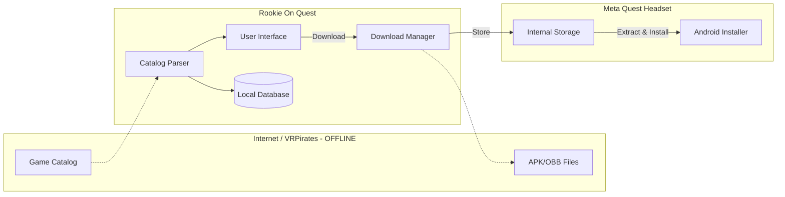

# 🛑 PROJECT CEASED / END OF LIFE

**Rookie On Quest is officially discontinued.**

Following the recent DMCA takedown by Meta (March 17, 2026) and the subsequent complete cessation of **VR Pirates (VRP)** and the **Rookie Sideloader** ecosystem, this project is no longer functional.

**The project has been archived.**

---

# 🚀 Rookie On Quest - Project Dashboard

Welcome to the **Rookie On Quest** dashboard. This document is now for historical reference only.

---

## 📊 Global Project Status

| Indicator | Current Value | Description |
| :--- | :--- | :--- |
| **Version** | `3.0.0` | Final stable release. |
| **Health** | 🔴 **End of Life** | Backend servers are offline. |
| **Current Focus** | 🛑 **None** | Project development has ceased. |
| **Last Update** | Mar 19, 2026 | Project archived following VRP shutdown. |

---

## 🗺️ Visual Roadmap (Historical)

Here is how the project evolved.

---

## 🏗️ Simplified Architecture (Legacy)

---

*This document is maintained for historical and educational purposes.*
