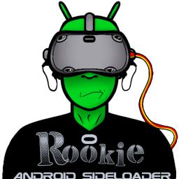

# Rookie On Quest

<p align="center">
  
  <br>
  
  
  
  
  
  <br><br>
  <a href="https://github.com/LeGeRyChEeSe/rookie-on-quest/releases/latest">
    
  </a>
</p>

A standalone Meta Quest application to browse, download, and install VR games natively. This project brings the power of the original Rookie Sideloader directly to your headset, eliminating the need for a PC during installation.

---

### Table of Contents
- [Overview](#overview)
- [Special Thanks](#special-thanks)
- [Key Features](#key-features)
- [Download & Installation](#download--installation)
- [Build from Source](#build-from-source)
- [Contributing](#contributing)

---

## Overview

**Rookie On Quest** is a standalone client for the Meta Quest, built natively with **Kotlin** and **Jetpack Compose**. It is important to note that this application is **entirely dependent on the servers and infrastructure maintained by the [Rookie](https://github.com/VRPirates/rookie)/VRPirates team**. It functions as a specialized interface for their services, and its operation relies completely on their continued work and server availability.

## Special Thanks

A huge thank you to the **Rookie developers and the VRPirates community**. Their hard work in maintaining the servers, catalog, and the original [Rookie sideloader](https://github.com/VRPirates/rookie) ecosystem is what makes this project possible. This app is a tribute to their dedication to the VR community.

### Key Features
- **Standalone Sideloading**: Install games (APK + OBB) directly on your Meta Quest without needing a PC.
- **Full Catalog Access**: Browse and search through the complete VRPirates library natively.
- **Optimized Performance**: Smooth and fast navigation through 2400+ game entries.
- **Zero Setup**: Open the app and start browsing immediately with no configuration required.

> [!TIP]
> **Performance Note**: Upon the first launch or after an update, the application extracts icons in the background.

---

## Download & Installation

### 1. Download the App
Get the latest version of **Rookie On Quest**:

[](https://github.com/LeGeRyChEeSe/rookie-on-quest/releases/latest)

### 2. Prepare your Quest
Ensure your Meta Quest is in **Developer Mode**. If you haven't enabled it yet:
1. Go to the [Meta Quest Developer Dashboard](https://dashboard.oculus.com/).
2. Create an "Organization".
3. Open the Meta Quest app on your phone, go to **Devices > Headset Settings > Developer Mode**, and toggle it on.

### 3. Install the APK
You can install the downloaded `.apk` file using one of the following methods:

#### Method A: SideQuest (Recommended)
1. Open **SideQuest** on your PC.
2. Connect your Quest via USB.
3. Drag and drop the `RookieOnQuest.apk` file into the SideQuest window.

#### Method B: ADB (Command Line)
If you have ADB installed, run:
```bash
adb install RookieOnQuest.apk
```

---

## Build from Source

### Prerequisites
- **Android Studio** (Ladybug or newer).
- **Android SDK 34** (API 34).

### Steps
1. Clone this repository.
2. Open the project in **Android Studio**.
3. Wait for Gradle to sync and download dependencies.
4. Go to `Build > Build Bundle(s) / APK(s) > Build APK(s)` or run `./gradlew assembleDebug`.

---

## Contributing

We welcome contributions! To maintain a clean project history, we strictly follow the **[Conventional Commits](https://www.conventionalcommits.org/)** specification.

### Naming Convention
All commit messages and pull requests should use the following prefixes:
- `feat:` for new features.
- `fix:` for bug fixes.
- `docs:` for documentation changes.
- `style:` for formatting or UI adjustments (no logic changes).
- `refactor:` for code changes that neither fix a bug nor add a feature.
- `perf:` for performance improvements.
- `chore:` for maintenance tasks.

### Share Ideas & Report Bugs
If you have an idea for a new feature or have found a bug, please open an issue:
- [Report a Bug](https://github.com/LeGeRyChEeSe/rookie-on-quest/issues/new?template=bug_report.md)
- [Suggest a Feature](https://github.com/LeGeRyChEeSe/rookie-on-quest/issues/new?template=feature_request.md)
- [Ask a Question or Give Feedback](https://github.com/LeGeRyChEeSe/rookie-on-quest/issues/new?template=question.md)

### Submit a Pull Request
1. Fork the repository.
2. Create a new branch (`feat/your-feature` or `fix/your-fix`).
3. Commit your changes following the naming convention.
4. Submit a pull request with a clear description of your changes.
