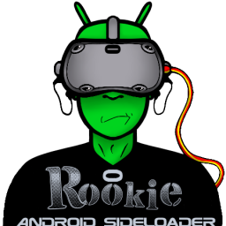

# 🛑 PROJECT CEASED / END OF LIFE

**Rookie On Quest is officially discontinued.**

Following the recent DMCA takedown by Meta (March 17, 2026) and the subsequent complete cessation of **VR Pirates (VRP)** and the **Rookie Sideloader** ecosystem, this project is no longer functional. Since Rookie On Quest was entirely dependent on VRP's servers and infrastructure to provide its catalog and downloads, the application can no longer fetch game lists or facilitate installations.

**The servers are offline, and the project has been archived.**

---

# Rookie On Quest

<p align="center">
  
  <br>
  
  
  
  
</p>

A standalone Meta Quest application to browse, download, and install VR games natively. **This project is now obsolete.**

---

### Table of Contents
- [Overview](#overview)
- [The End of the Journey](#the-end-of-the-journey)
- [Special Thanks](#special-thanks)
- [Key Features (Legacy)](#key-features-legacy)
- [Download & Installation (Legacy)](#download--installation-legacy)

---

## Overview

**Rookie On Quest** was a standalone client for the Meta Quest, built natively with **Kotlin** and **Jetpack Compose**. It functioned as a specialized interface for the [Rookie](https://github.com/VRPirates/rookie)/VRPirates ecosystem. 

As stated since the project's inception, this application was **entirely dependent on the servers and infrastructure maintained by the VRPirates team**. With their infrastructure now permanently offline following legal action, this app has reached its end of life.

## The End of the Journey

On March 17, 2026, the VR Pirates team announced their complete and permanent shutdown following a DMCA request from Meta. This included the removal of all mirrors, the cessation of their cracking operations, and the disabling of the backend servers that Rookie On Quest relied upon.

Without these servers, the app can no longer:
- Fetch the game catalog.
- Download APK or OBB files.
- Provide update information.

The repository remains here for educational purposes and as a testament to the work put into the Android implementation, but **no further updates will be provided and the app is non-functional.**

## Special Thanks

A final and heartfelt thank you to the **Rookie developers and the VRPirates community**. Their years of dedication to the VR community made this project possible. We respect their decision to cease operations and thank them for the journey.

### Key Features (Legacy)
- **Standalone Sideloading**: (Disabled) Install games (APK + OBB) directly on your Meta Quest.
- **Full Catalog Access**: (Disabled) Browse and search through the complete VRPirates library.
- **Background Downloads**: (Disabled) Optimized to continue downloading even when the device sleeps.
- **Optimized Performance**: Smooth navigation through 2400+ game entries.

---

## Download & Installation (Legacy)

> [!WARNING]
> **The application will no longer function.** The instructions below are kept for historical reference only.

---

## Build & Development Commands

### Prerequisites
- **Android Studio** (Ladybug or newer).
- **Android SDK 34** (API 34).

### Building the Project
1. Clone this repository.
2. Open the project in **Android Studio**.
3. Wait for Gradle to sync and download dependencies.
4. Go to `Build > Build Bundle(s) / APK(s) > Build APK(s)` or run `./gradlew assembleDebug`.

### CI/CD & Local Validation
This project uses GitHub Actions for PR validation. You can run the validation logic locally to catch issues before pushing:

- **Windows:** `powershell scripts/test-ci-logic.ps1`
- **Linux/macOS:** `./scripts/test-ci-logic.sh`

For more details on the build pipeline, see the **[Infrastructure Architecture](docs/architecture-infra.md)** documentation.

### Version Management
This project follows **[Semantic Versioning (SemVer)](https://semver.org/)**.

When building from the command line, you can specify the version using Gradle properties:
- `versionCode`: A positive integer (e.g., `-PversionCode=15`)
- `versionName`: A SemVer compatible string (e.g., `-PversionName=2.5.0` or `-PversionName=2.5.0-rc.1`)

The `versionName` must match the format `X.Y.Z` with optional pre-release suffixes or build metadata:
- Basic: `2.5.0`
- Pre-release: `2.5.0-rc`, `2.5.0-beta.1`, `2.5.0-alpha`
- Build metadata: `2.5.0+build.1`
- Combined: `2.5.0-rc.1+build.1`

The regex pattern used is: `^[0-9]+\.[0-9]+\.[0-9]+(-[a-zA-Z0-9.]+)?(\+[a-zA-Z0-9.]+)?$`

### Secure Update Authentication
To enable application update checks, a secret key is required for request signing.
- **Environment Variable:** `ROOKIE_UPDATE_SECRET`
- **Local Development:** You can provide this in your `local.properties` file or as a Gradle property:
  ```properties
  ROOKIE_UPDATE_SECRET=your_secret_here
  ```
- **Release Builds:** For security, release builds will fail if this secret is not provided via the environment variable or `keystore.properties`.

---

## Contributing

We welcome contributions! To maintain a clean project history, we strictly follow the **[Conventional Commits](https://www.conventionalcommits.org/)** specification.

### Naming Convention
All commit messages and pull requests should use the following prefixes:
- `feat:` for new features.
- `fix:` for bug fixes.
- `docs:` for documentation changes.
- `style:` for formatting or UI adjustments (no logic changes).
- `refactor:` for code changes that neither fix a bug nor add a feature.
- `perf:` for performance improvements.
- `chore:` for maintenance tasks.

### Share Ideas & Report Bugs
If you have an idea for a new feature or have found a bug, please open an issue:
- [Report a Bug](https://github.com/LeGeRyChEeSe/rookie-on-quest/issues/new?template=bug_report.md)
- [Suggest a Feature](https://github.com/LeGeRyChEeSe/rookie-on-quest/issues/new?template=feature_request.md)
- [Ask a Question or Give Feedback](https://github.com/LeGeRyChEeSe/rookie-on-quest/issues/new?template=question.md)

### Submit a Pull Request
1. Fork the repository.
2. Create a new branch (`feat/your-feature` or `fix/your-fix`).
3. Commit your changes following the naming convention.
4. Submit a pull request with a clear description of your changes.
